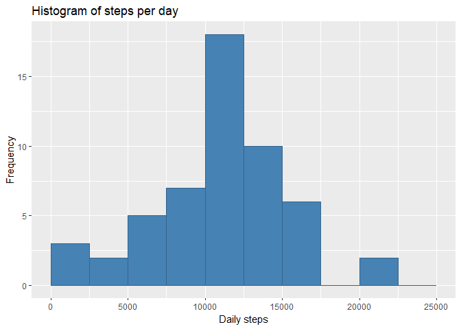
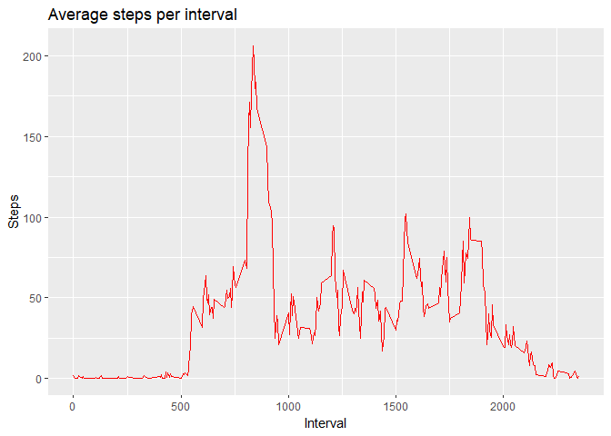
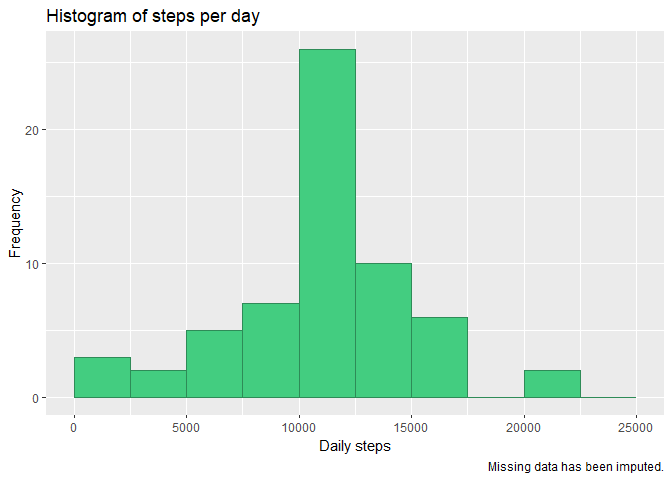
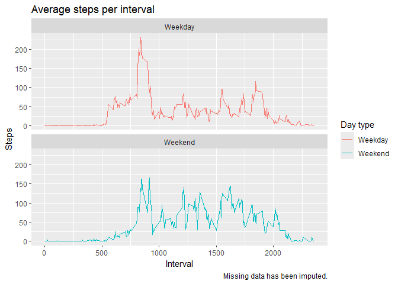

## Introduction

It is now possible to collect a large amount of data about personal movement
using activity monitoring devices such as a Fitbit, Nike Fuelband, or
JawboneUp.These type of devices are part of the "quantified self" movement 
a group of enthusiasts who take measurements about themselves regularly to 
improve their health, to find patterns in their behavior, or because they are 
tech geeks. But these data remain under-utilized both because the raw data 
are hard to obtain and there is a lack of statistical methods and software 
for processing and interpreting the data.

This assignment makes use of data from a personal activity monitoring device.
This device collects data at 5 minute intervals through out the day. The data
consists of two months of data from an anonymous individual collected during
the months of October and November, 2012 and include the number of steps taken
in 5 minute intervals each day.

The variables included in this dataset are:

- **steps:** Number of steps taking in a 5-minute interval (missing values are coded as NA)
- **date:** The date on which the measurement was taken in YYYY-MM-DD format
- **interval:** Identifier for the 5-minute interval in which measurement was taken

The dataset is stored in a comma-separated-value (CSV) file and there are a total of 17,568 observations in this dataset.

## Set global knitr options and load libraries


``` r
knitr::opts_chunk$set(echo = TRUE, options(scipen=999), fig.path="./figure/")
library(dplyr)
library(ggplot2)
```

## Loading the data

The data is downloaded into the working directory and unzipped, if either of
these steps has not been done previously. The data is then loaded into 
the data frame repdata.


``` r
projectfile <- "repdata_data_activity.zip"

if(!file.exists(projectfile)) {
  fileURL <- 
    "https://d396qusza40orc.cloudfront.net/repdata%2Fdata%2Factivity.zip"
  download.file(fileURL, projectfile, method = "curl")
}

if(!file.exists("activity.csv")) {
  unzip(projectfile, files = "activity.csv")
}

repdata <- read.csv("activity.csv")
```

## Analysis: mean steps per day

1. Calculate the number of steps taken each day.


``` r
daily.data <- repdata %>% 
  group_by(date) %>% 
  summarise(daily.steps = sum(steps), na.rm=TRUE)
```

2. Plot a histogram of the number of steps taken each day.


``` r
h1 <- ggplot(daily.data, aes(x=daily.steps)) +
  geom_histogram(fill = "steelblue", col = "steelblue4", breaks = seq(0, 25000, by = 2500)) +
  xlab("Daily steps") +
  ylab("Frequency") +
  ggtitle("Histogram of steps per day")
print(h1)
```

```
## Warning: Removed 8 rows containing non-finite outside the scale range
## (`stat_bin()`).
```

<!-- -->

3. Show the mean and median of the number of steps taken each day.


``` r
step.mean <- mean(daily.data$daily.steps, na.rm=TRUE)
step.mean
```

```
## [1] 10766.19
```

``` r
step.median <- median(daily.data$daily.steps, na.rm=TRUE)
step.median
```

```
## [1] 10765
```

The mean number of steps per day is 10766.  
The median number of steps per day is 10765.

## Average daily activity pattern

1. Make a time series plot of the 5-minute interval (x-axis) and the
average number of steps taken, averaged across all days (y-axis)


``` r
# calculate the number of steps in each 5 minute interval averaged across all days
averageStepsPerInterval <- aggregate(steps ~ interval, repdata, mean)

# create time series plot of average steps per interval
ts <- ggplot(averageStepsPerInterval, aes(x=interval, y=steps)) +
  geom_line(col="red") +
  labs(title="Average steps per interval", x = "Interval", y="Steps")
print(ts)
```

<!-- -->

2. Which 5-minute interval, on average across all the days in the dataset,
contains the maximum number of steps?


``` r
maxInterval <- averageStepsPerInterval[which.max(averageStepsPerInterval$steps), ]
```

The interval 835 has the maximum number of steps,
with an average of 206.2 steps.

## Imputing missing values

1. Calculate and report the total number of missing values in the dataset.


``` r
count.na <- sum(is.na(repdata$steps))
```

The dataset has 2304 missing values.

2. Devise a strategy for filling in all of the missing values in the dataset. The strategy does not need to be sophisticated. For example, you could use the mean/median for that day, or the mean for that 5-minute interval, etc.

3. In this exercise, missing values are replaced by the mean for that 5-minute
interval.


``` r
imputed_data <- repdata %>%
  mutate(steps = case_when(
    is.na(steps) ~ averageStepsPerInterval$steps[match(repdata$interval,averageStepsPerInterval$interval)],
    TRUE ~ as.numeric(steps)
  ))
```

4. Make a histogram of the total number of steps taken each day and calculate and report the mean and median total number of steps taken per day.


``` r
daily.imputed.data <- imputed_data %>% 
  group_by(date) %>% 
  summarise(daily.steps = sum(steps))

h2 <- ggplot(daily.imputed.data, aes(x=daily.steps)) +
  geom_histogram(fill = "seagreen3", col = "seagreen4", breaks = seq(0, 25000, by = 2500)) +
  xlab("Daily steps") +
  ylab("Frequency") +
  ggtitle("Histogram of steps per day") +
  labs(caption = "Missing data has been imputed.")
print(h2)
```

<!-- -->

``` r
imputed.mean <- mean(daily.imputed.data$daily.steps, na.rm=TRUE)
imputed.median <- median(daily.imputed.data$daily.steps, na.rm=TRUE)
```

In the imputed data, the mean number of steps per day is 10766.1886792 
while in the original data the mean is 10766.1886792.  
The median in the imputed data is 10766.1886792 and in the original data
the median is 10765.

## Differences in activity patterns between weekdays and weekends

1. Create a new factor variable in the dataset with two levels- "weekday" 
and "weekend" indicating whether a given date is a weekday or weekend day.


``` r
# convert date from character to date format
imputed_data$date <- as.Date(imputed_data$date, format="%Y-%m-%d")

#create new variable denoting weekday or weekend
imputed_data$day_type <- sapply(imputed_data$date, function(x) {
  if(weekdays(x) == "Saturday" | weekdays(x) == "Sunday")
  {y <- "Weekend"}
  else {y <- "Weekday"}
  y
})
```

2. Make a panel plot containing a time series plot (i.e. type = "l") 
of the 5-minute interval (x-axis) and the average number of steps taken,
averaged across all weekday days or weekend days (y-axis).


``` r
# calculate the number of steps in each 5 minute interval averaged by day_type
avgstepsbytype <- aggregate(steps ~ interval + day_type, imputed_data, mean)

# create time series plot of average steps per interval
ts2 <- ggplot(avgstepsbytype, aes(x=interval, y=steps, color=day_type)) +
  geom_line() +
  labs(title="Average steps per interval", x = "Interval", y="Steps") +
  facet_wrap(~day_type, ncol=1, nrow=2) +
  scale_color_discrete(name="Day type") +
  labs(caption = "Missing data has been imputed.")
print(ts2)
```

<!-- -->
